# Architecture Diagrams - Mermaid Visualizations

**Дата:** 2026-02-06
**Версия:** 1.0

Визуальные диаграммы архитектур всех трёх систем в формате Mermaid для удобного просмотра на GitHub.

---

## 📊 Table of Contents

- [OpenClaw (Moltbot) - Gateway Pattern](#openclaw-moltbot---gateway-pattern)
- [Orchestrator Kit - Orchestrator Pattern](#orchestrator-kit---orchestrator-pattern)
- [Leonardo AI - Corpus Callosum Pattern](#leonardo-ai---corpus-callosum-pattern)
- [Comparison Overview](#comparison-overview)
- [Data Flow Diagrams](#data-flow-diagrams)

---

## 🔌 OpenClaw (Moltbot) - Gateway Pattern

### High-Level Architecture

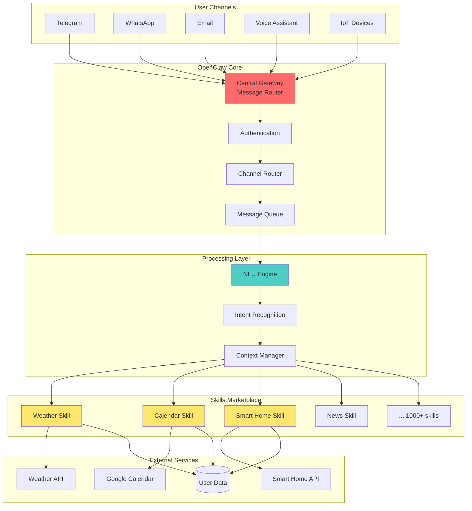

### Skill Execution Flow

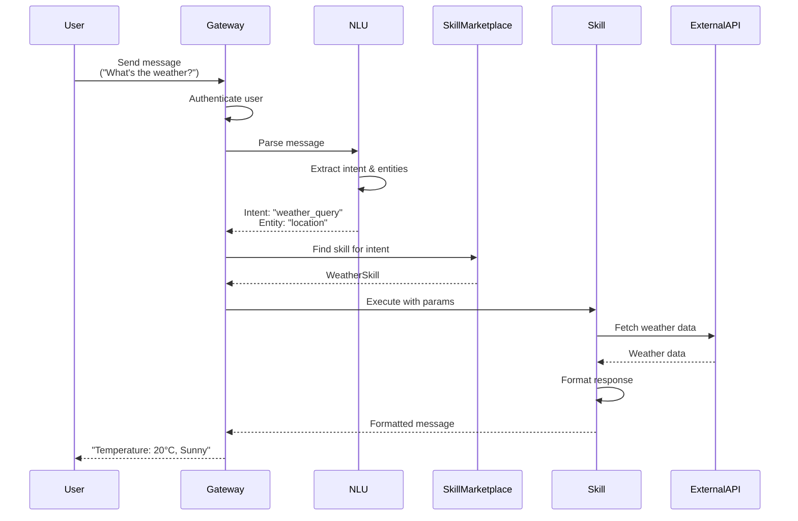

### Pattern: Gateway (Hub-and-Spoke)

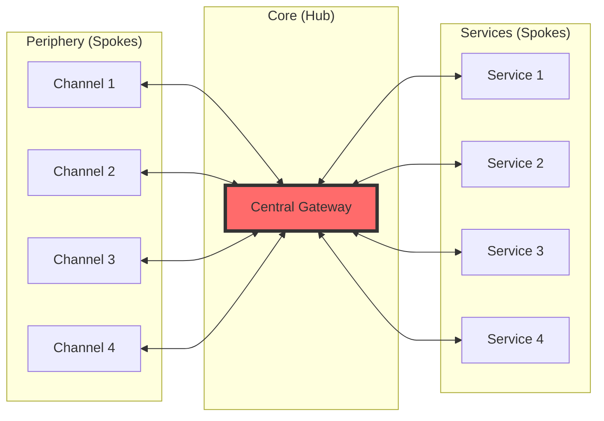

---

## 🎼 Orchestrator Kit - Orchestrator Pattern

### High-Level Architecture

```mermaid
graph TB
    subgraph "User Interface"
        CLI[Claude Code CLI]
        IDE[VS Code / Cursor]
    end

    subgraph "Orchestration Layer"
        MASTER[Master Orchestrator]
        PLANNER[Task Planner]
        COORDINATOR[Agent Coordinator]
        MONITOR[Performance Monitor]
    end

    subgraph "Agent Pool (59 agents)"
        direction LR
        A1[Software Architect]
        A2[Backend Developer]
        A3[Frontend Developer]
        A4[DBA]
        A5[DevOps Engineer]
        A6[QA Engineer]
        AN[... 53 more agents]
    end

    subgraph "Skills Library (51 skills)"
        S1[Code Analysis]
        S2[Test Generation]
        S3[API Design]
        S4[Database Schema]
        SN[... 47 more skills]
    end

    subgraph "Commands (41 commands)"
        CMD1[/analyze]
        CMD2[/implement]
        CMD3[/test]
        CMD4[/deploy]
        CMDN[... 37 more]
    end

    subgraph "External Systems"
        GIT[Git Repository]
        API[Claude API]
        TOOLS[Development Tools]
        DB[(Project Database)]
    end

    CLI --> MASTER
    IDE --> MASTER

    MASTER --> PLANNER
    PLANNER --> COORDINATOR
    COORDINATOR --> MONITOR

    MONITOR --> A1
    MONITOR --> A2
    MONITOR --> A3
    MONITOR --> A4
    MONITOR --> A5
    MONITOR --> A6
    MONITOR --> AN

    A1 --> S1
    A2 --> S2
    A3 --> S3
    A4 --> S4

    S1 --> CMD1
    S2 --> CMD2
    S3 --> CMD3
    S4 --> CMD4

    CMD1 --> GIT
    CMD2 --> API
    CMD3 --> TOOLS
    CMD4 --> DB

    style MASTER fill:#9b59b6
    style PLANNER fill:#3498db
    style A1 fill:#2ecc71
    style A2 fill:#2ecc71
    style A3 fill:#2ecc71
```

### Task Execution Flow

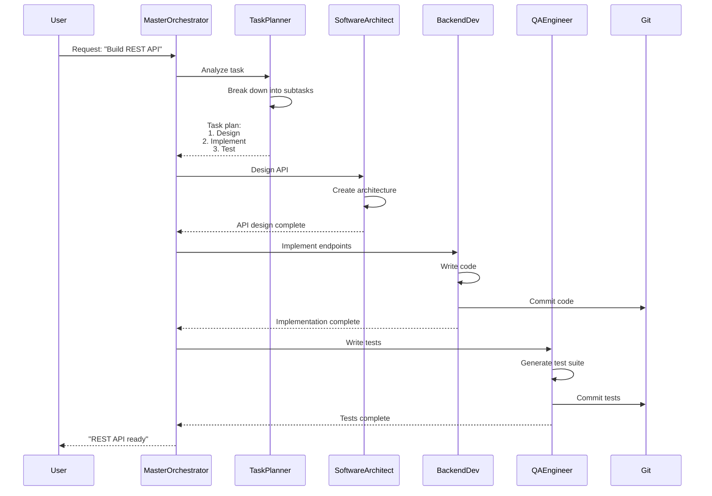

### Pattern: Orchestrator (Conductor)

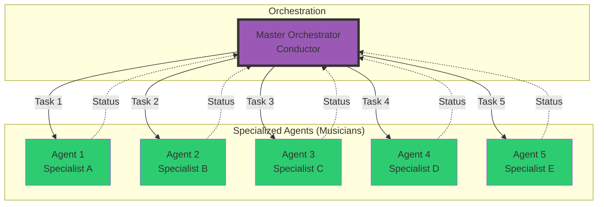

---

## 🎨 Leonardo AI - Corpus Callosum Pattern

### High-Level Architecture

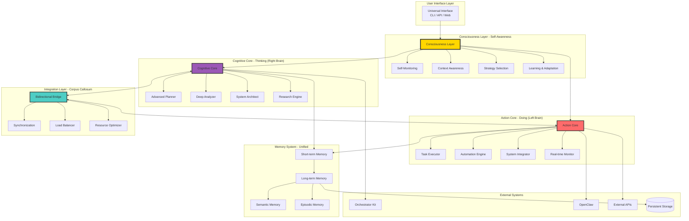

### Strategy Selection Flow

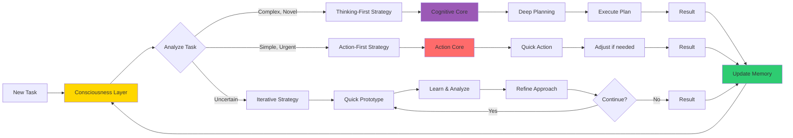

### Five Operational Modes

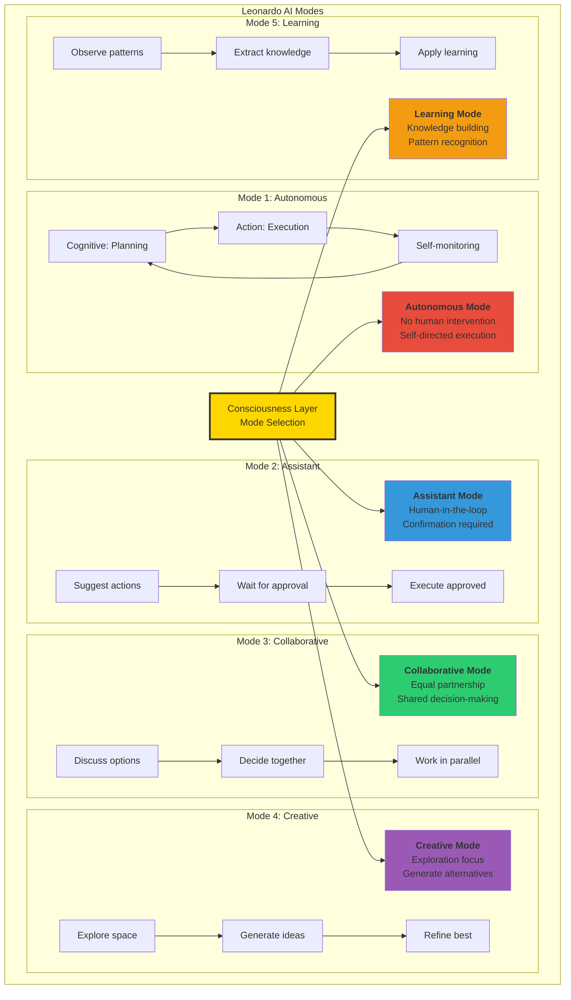

### Pattern: Corpus Callosum (Brain Hemispheres)

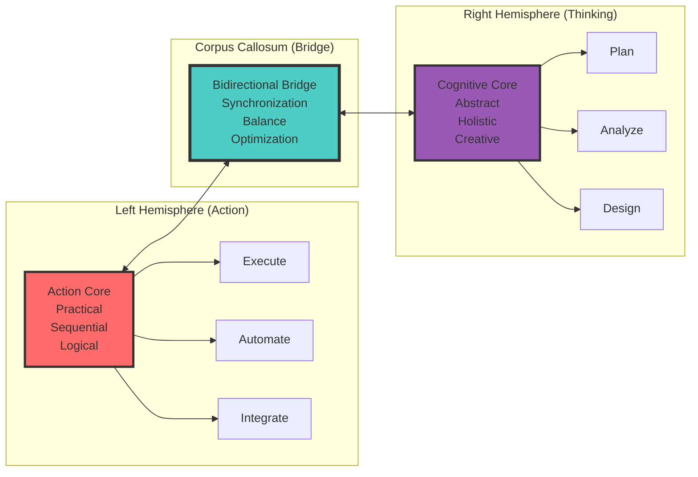

---

## 📊 Comparison Overview

### All Three Architectures Side by Side

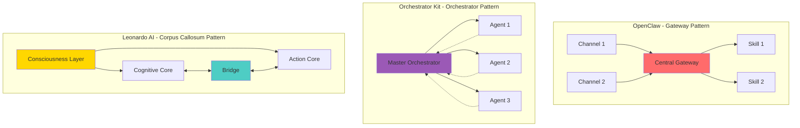

### Evolution Timeline

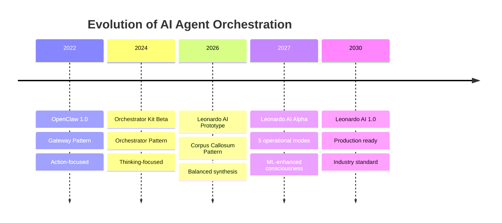

---

## 🔄 Data Flow Diagrams

### OpenClaw Data Flow

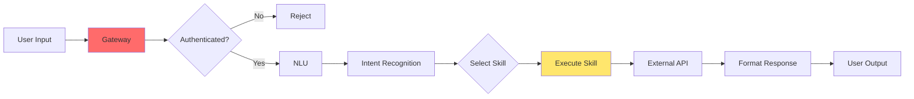

### Orchestrator Kit Data Flow

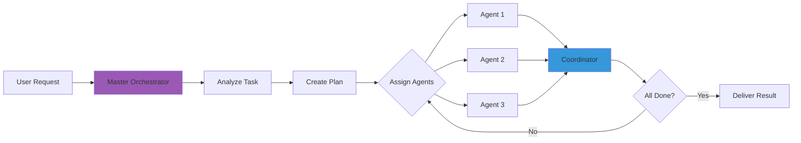

### Leonardo AI Data Flow

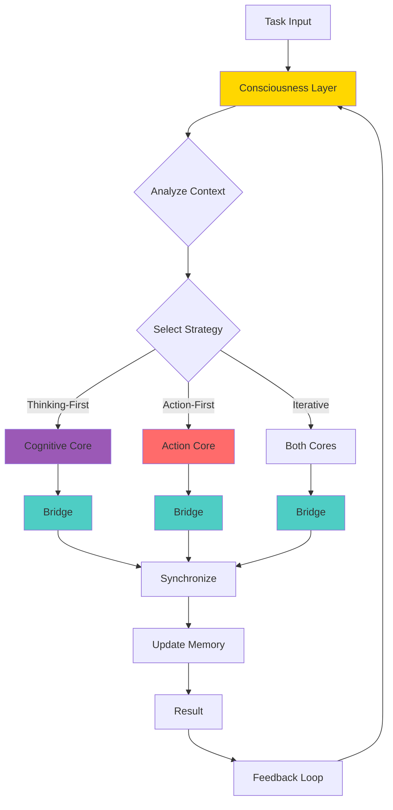

---

## 🎯 Key Differences Matrix

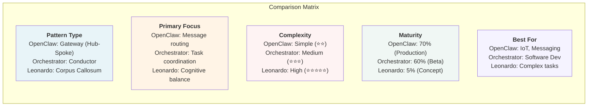

---

## 🚀 Implementation Phases

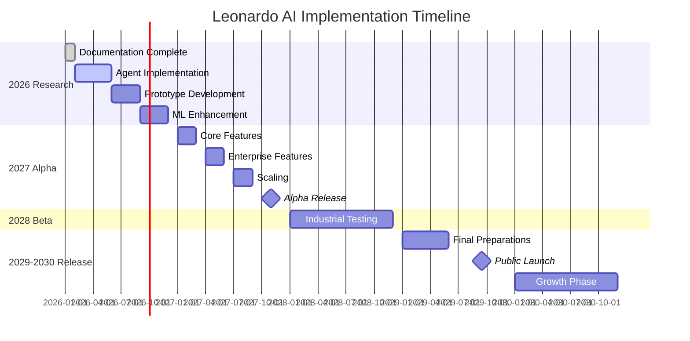

---

## 📐 Component Interaction

### Leonardo AI Component Interaction Detail

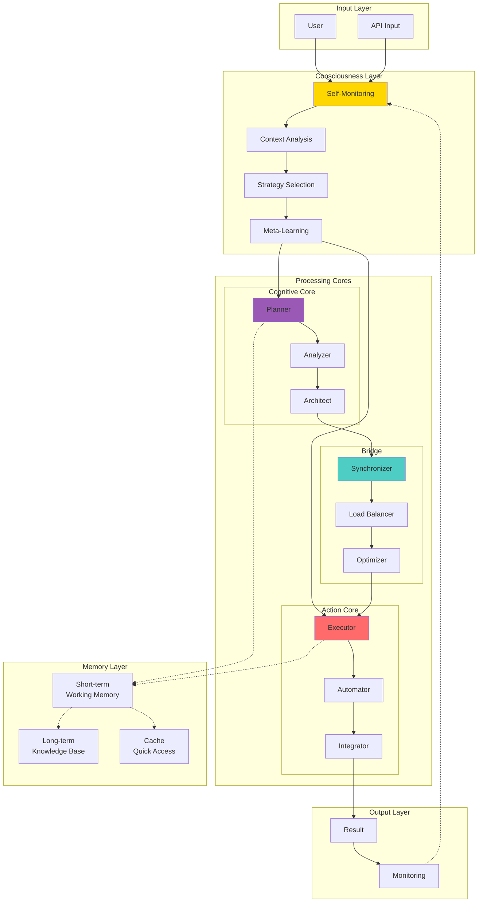

---

## 📝 Legend

### Color Coding

- 🟡 **Yellow (#ffd700)** - Consciousness / Self-awareness components
- 🟣 **Purple (#9b59b6)** - Cognitive / Thinking components
- 🔴 **Red (#ff6b6b)** - Action / Execution components
- 🔵 **Cyan (#4ecdc4)** - Integration / Bridge components
- 🟢 **Green (#2ecc71)** - Specialized agents / skills
- 🟡 **Light Yellow (#ffe66d)** - External services / skills

### Diagram Types

- **Graph TB/LR** - Top-to-bottom or left-to-right flow diagrams
- **Sequence Diagram** - Interaction over time
- **Flowchart** - Decision and data flow
- **Timeline** - Historical evolution
- **Gantt** - Project timeline with phases

---

## 🔗 Related Documents

- [ARCHITECTURE.md](ARCHITECTURE.md) - ASCII diagrams and detailed descriptions
- [LEONARDO_AI_DETAILED.md](LEONARDO_AI_DETAILED.md) - Leonardo AI architecture deep dive
- [OPENCLAW_VS_ORCHESTRATOR_DETAILED.md](OPENCLAW_VS_ORCHESTRATOR_DETAILED.md) - Detailed comparison

---

## 📊 Usage Notes

These Mermaid diagrams will render automatically on GitHub, providing:

✅ **Interactive diagrams** - Zoom, pan, and explore
✅ **Professional visualization** - Clean, modern appearance
✅ **Easy updates** - Text-based, version-controllable
✅ **Accessibility** - Screen reader friendly
✅ **Multi-format export** - PNG, SVG, PDF (via tools)

To view locally or export:
- Use [Mermaid Live Editor](https://mermaid.live/)
- Install [VS Code Mermaid extension](https://marketplace.visualstudio.com/items?itemName=bierner.markdown-mermaid)
- Use [mermaid-cli](https://github.com/mermaid-js/mermaid-cli) for batch export

---

**Version:** 1.0
**Last Updated:** 2026-02-06
**Maintained by:** info7 Contributors

https://claude.ai/code/session_01WnQdgU1MrECnhh3xfVNRAg
